# Office Sensor Application
## Overview
In this example, you create a simple application that collects weather sensor data from a Raspberry Pi Sense HAT and periodically publishes the data to AWS IoT Core MQTT topics.

You need the following:
* A [Raspberry Pi](https://www.raspberrypi.org/products/)
* A [Sense HAT](https://www.raspberrypi.org/products/sense-hat/)

## Set up the Environment
### Register Thing on AWS IoT Core Console
To get started, register your Raspberry Pi as a thing in the AWS IoT Core console.

From the AWS IoT Core menu, navigate to **Manage** -> **Things**. Select **Create** at the top right of the page.

---

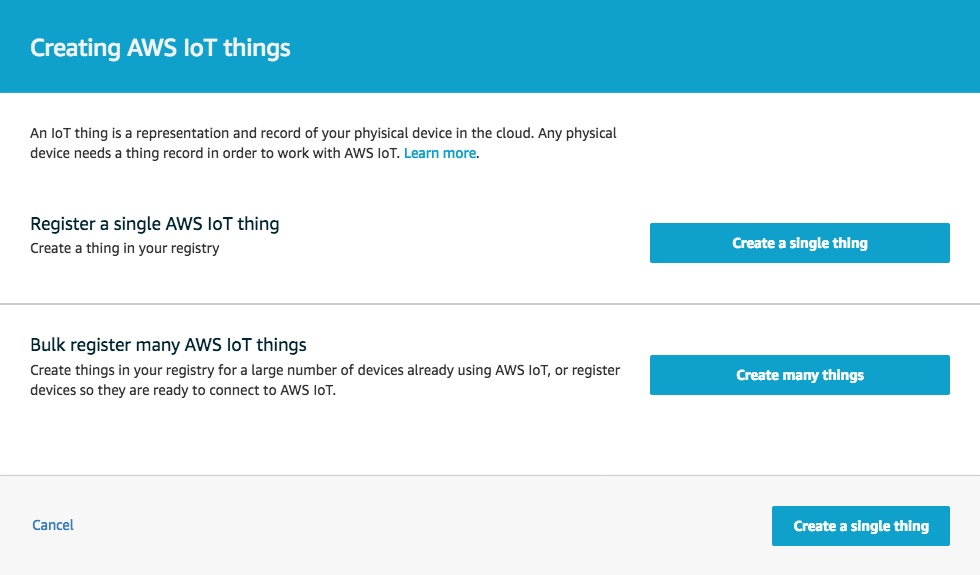

---

Select **Create a single thing**. The console directs you to the first **Create a Thing** step.

---

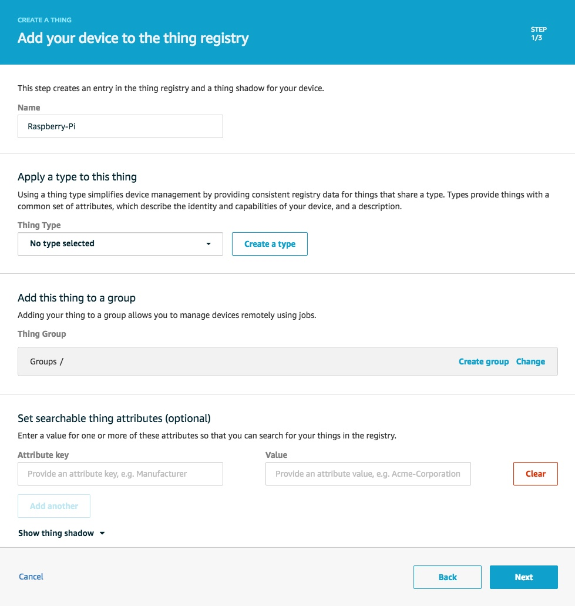

---

Give the thing a name, leave the other properties as their default values, and select **Next**.

---


---

To create a certificate and a public and a private key for your thing, select **Create certificate**.

---

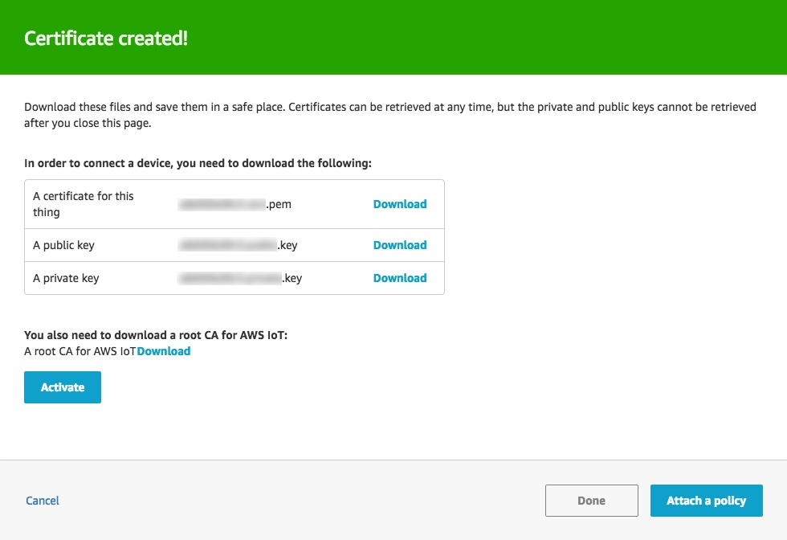

---

Download the certificate, the public key, the private key, and the root CA. Be sure to activate the certificate and keys. To attach a security policy to the certificates, select **Attach a policy**.

---

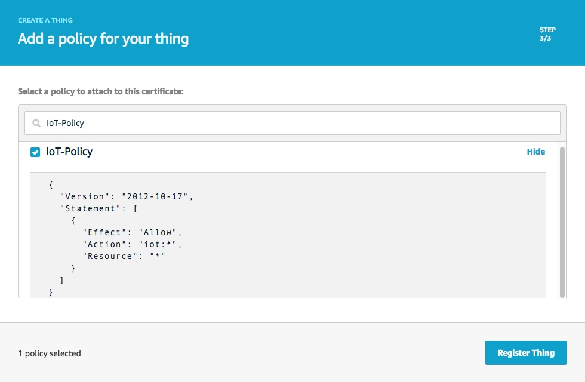

---

Select the **IoT-Policy** policy. If you don't have an **IoT-Policy** policy, create one. To finish registering your application as a thing, select **Register Thing**.

### Raspberry Pi
#### Prerequisites
Your Raspberry Pi's environment needs the following prerequisite Python libraries to collect data from the Sense HAT and to publish to MQTT topics: 

* `sense_hat`
* `AWSIoTPythonSDK`

If you don't already have these libraries, you can install them with `pip`.

#### Authentication
To interact with the Python MQTT Client API (a submodule of the AWS IoT Device SDK for Python), your application needs to have access to the directory that contains your private key, your device certificate, and the root server certificate. 

Move the certificates and keys that you obtained when registering the Raspberry Pi into the `certs` directory.

#### Configuration

[`config.py`](./config.py) defines some configuration variables that your application can access:
```python
# config.py

# AWS IoT endpoint settings
HOST_NAME = "your-aws-account-specific-prefix.iot.your-region.amazonaws.com"
HOST_PORT = 8883

# Thing certs & keys
PRIVATE_KEY = "certs/private.pem.key"
DEVICE_CERT = "certs/certificate.pem.crt"
ROOT_CERT = "certs/root-CA.crt"

# Message settings
SENSOR_TOPIC = "office/weather"
QOS_LEVEL = 0
```
Be sure to define the HOST\_NAME variable with your AWS IoT API endpoint. To obtain your AWS IoT API endpoint, you can issue the following command:

```bash
$ aws iot describe-endpoint
```

## Collect and Publish Data
### Office Sensor Application
[`sense.py`](sense.py) defines a simple application that collects data from the Sense HAT and publishes that data to MQTT topics served by the AWS IoT Broker.

To start the application, you can issue the following command from the `office-sensor` directory on your Raspberry Pi:

```bash
$ python sense.py
```

The application publishes individual readings for temperature to `office/metrics/Temperature`, humidity to `office/metrics/Humidity`, and pressure to `office/metrics/Pressure`. The application also sends all readings in a single payload to `office/weather`.

### AWS IoT Analytics Console
#### Create Channel
Open the AWS IoT Analytics console and navigate to the **Channels** page. Select **Create** at the top right of the page to create a new channel.

---


---

Enter a channel ID and select **Next**.

---


---

Enter your weather sensor MQTT topic for the **IoT Core topic filter**. The channel creates a subscription to this topic.

You also need an IAM role to allow AWS IoT Core to publish messages to the channel. You can create your own.

---

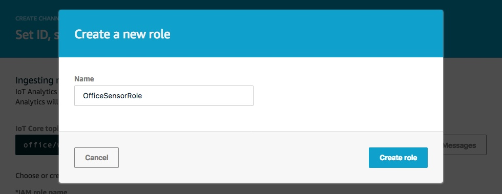

---

Enter the name of the role you want to create and select **Create Role**. To create the channel, select **Create Channel**.

#### Create Datastore
From the AWS IoT Analytics console menu, navigate to the **Data stores** page. Select **Create** at the top right corner of the page to create a new data store.

---


---

Give the data store a name and select **Create data store**.

#### Create Pipeline
Navigate to the **Pipelines** page and select **Create** to start creating a new pipeline.

---

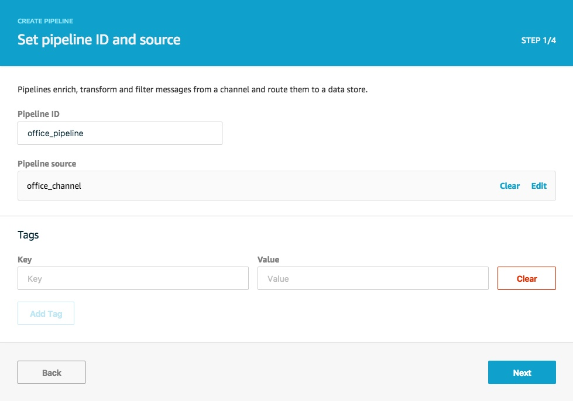

---

Give your pipeline a name, select the source channel, and select **Next**.

---

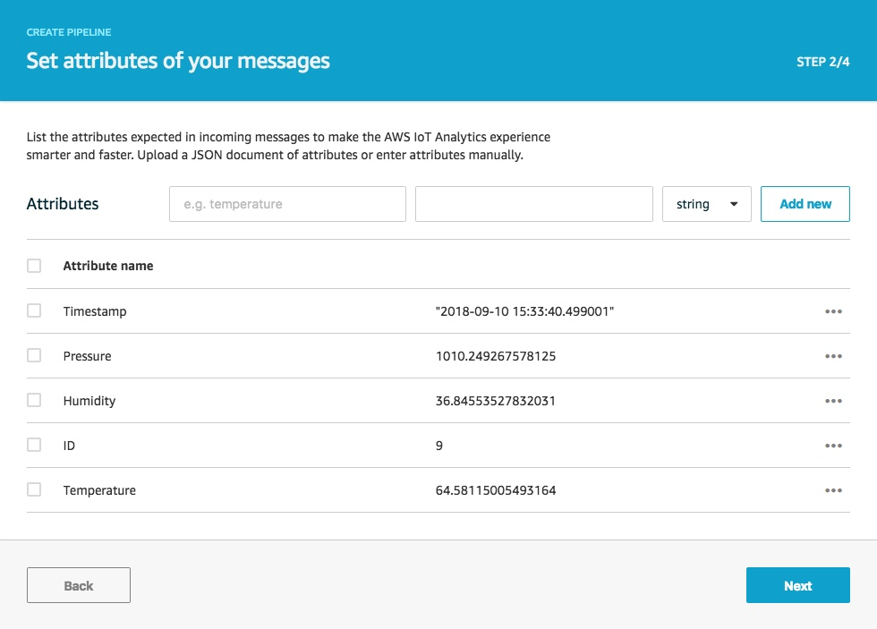

---

If the console can't infer the attributes in the JSON message from the channel, you need to upload a sample JSON file, or manually enter a name, sample value, and data type for each attribute.

---


---

You don't need to specify any additional pipeline activities at this point. Select **Next**.

---

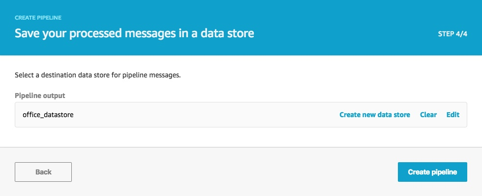

---

Set the output to the data store you created earlier, and select **Create pipeline**. 

When you create a pipeline, AWS IoT Analytics creates a rule in AWS IoT Core. The rule sends data published to the MQTT topic that you specified for your channel to the data store of your choice.

#### Create Data Set

A data set is a subset of the data in your data store. Create your data set from a SQL query on the data store.

From the AWS IoT Analytics console menu, navigate to **Data sets**. Select **Create** in the top right corner of the page.

---


---

Select **Create SQL** to create a SQL data set.

___

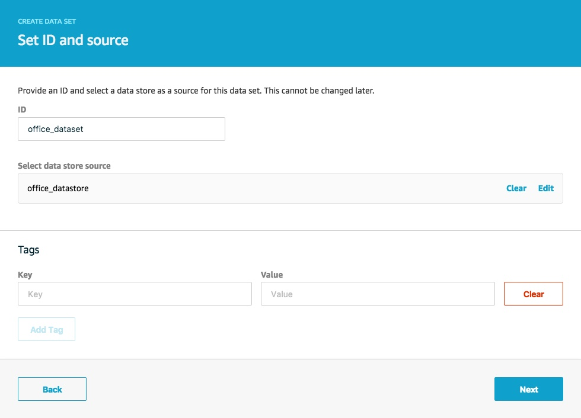

---

Give the data set a name, specify the data store source, and select **Next**.

---


---

Leave the SQL query as its default value to generate a data set from all of the attributes in the data store. Select **Next**.

---

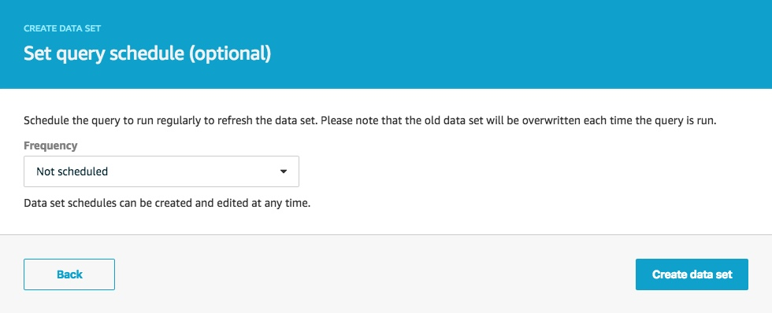

---

The data set's SQL query has no scheduled frequency by default. To create the data set, select **Create data set**.

To run the query and create the data set, open the data set, and select **Run now** under the **Actions** tab. 

---


---

The **Result preview** should start populating with values from the data store.

---

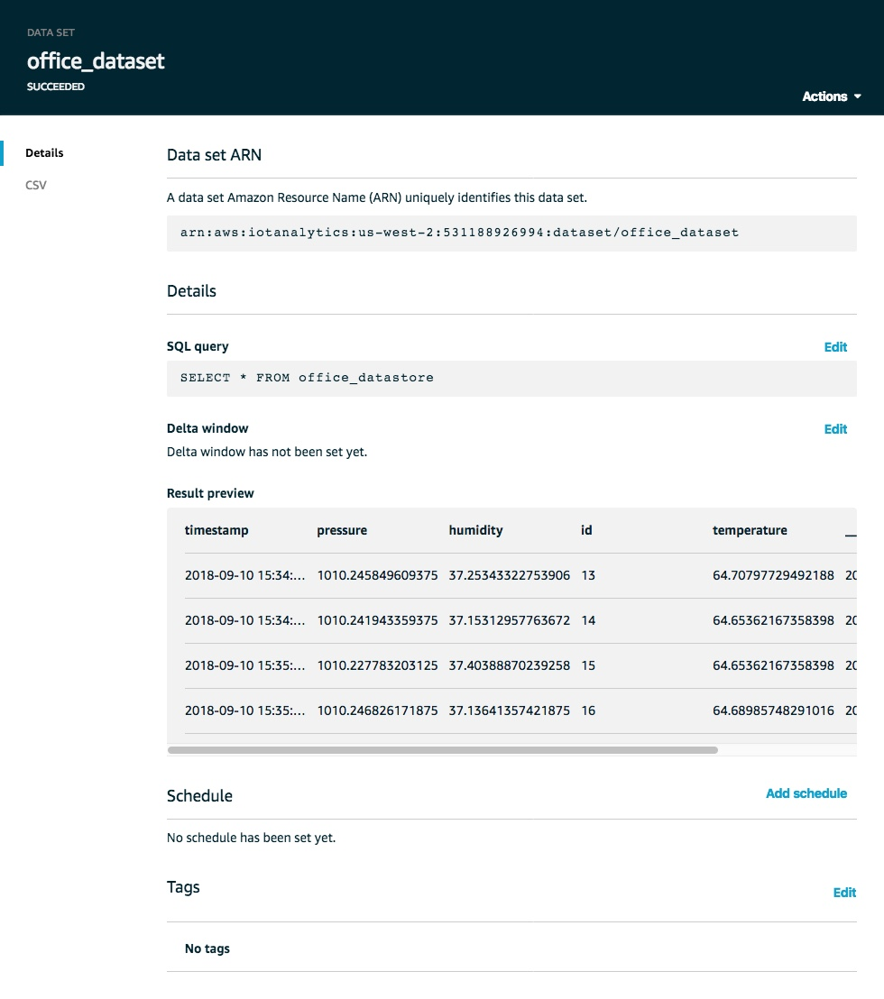

---

## Analyze and Visualize Data
### Jupyter Notebook
From AWS IoT Analytics, you can send the data to a Jupyter notebook for further analysis. AWS Sagemaker serves a Jupyter notebook application. You can import data from your AWS IoT Analytics data sets into a notebook using the [AWS SDK for Python](https://boto3.readthedocs.io/en/latest/).

Check out the example notebook, [OfficeSensor.ipynb](./OfficeSensor.ipynb), for descriptive statistics and plots.

### Web Application
You can alternatively use the [web application](../flask/) for visualize and analyze data.
